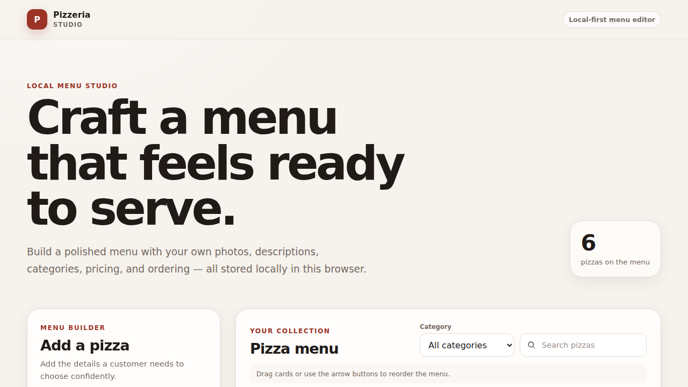
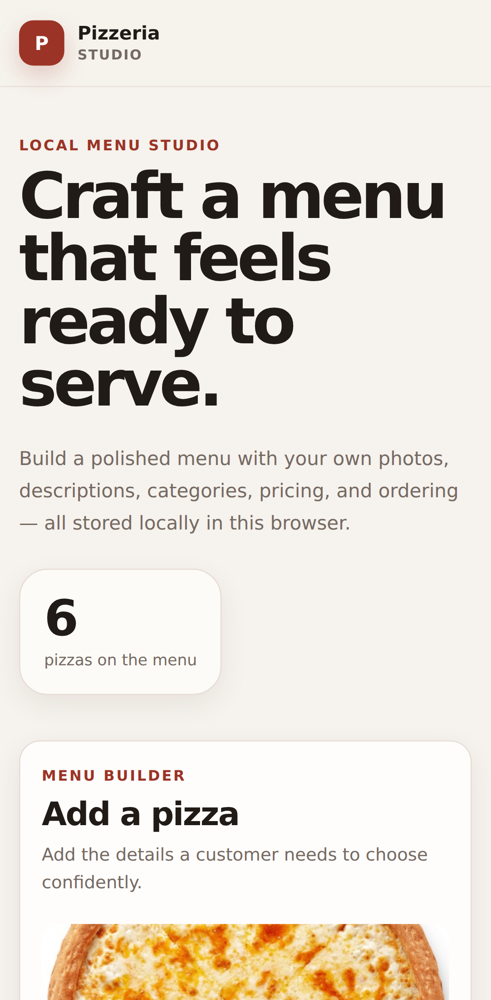

# Pizzeria Studio

[](https://github.com/MykolaDotsenko/Pizzeria-React-Typescript-Project/actions/workflows/ci.yml)


**A production-minded, local-first pizzeria menu editor built to demonstrate reliable React and TypeScript engineering without unnecessary backend complexity.**

[**Open the live app →**](https://pizza-react-typescript.vercel.app) · [Architecture](./ARCHITECTURE.md) · [Browser tests](./e2e/menu.spec.ts) · [Screenshot test](./e2e/screenshots.spec.ts)



Pizzeria Studio turns a small CRUD exercise into a compact product case study: menu editing, image processing, ordering, persistence, migrations, recovery, and cross-browser verification all live behind explicit boundaries.

## Why this project is interesting

The application stays intentionally small, but the failure modes are treated seriously:

- **Money is stored as integer cents**, not floating-point domain state.
- **Untrusted persisted data is validated at the boundary** with Zod.
- **Uploaded images are resized and compressed locally** before they enter browser storage.
- **State transitions are pure reducer operations**, including reorder and Undo.
- **Persistence is isolated behind one adapter** with versioned migrations.
- **Unknown future schemas fail safe** and are never silently downgraded.
- **Same-event mutations compose against one authoritative snapshot**, avoiding stale-state persistence bugs.
- **Reordering works with drag-and-drop and accessible controls**, so mouse interaction is not the only path.
- **Quality gates cover four browser profiles** before changes are considered healthy.

## Product capabilities

| Workflow    | Behavior                                                 |
| ----------- | -------------------------------------------------------- |
| Create      | Add name, description, category, price, and photo        |
| Edit        | Update an existing pizza inline                          |
| Discover    | Search name/description and filter by category           |
| Organize    | Drag cards or use keyboard-accessible move controls      |
| Recover     | Delete with a non-blocking Undo action                   |
| Persist     | Preserve edits, ordering, uploads, and deletions locally |
| Navigate    | Open dedicated pizza-detail routes                       |
| Migrate     | Upgrade legacy storage schemas through version 3         |
| Fail safely | Surface storage failures and protect unknown future data |

## Responsive product

<table>
  <tr>
    <td width="68%">
      
    </td>
    <td width="32%">
      
    </td>
  </tr>
  <tr>
    <td align="center"><strong>Desktop workspace</strong><br/>Editor and menu remain visible as one operating surface.</td>
    <td align="center"><strong>Mobile flow</strong><br/>The same core workflow stays usable on a narrow viewport.</td>
  </tr>
</table>

The screenshots are generated from the **real production build** by Playwright. They are not design mockups.

## Stack

### Runtime

- React **19.3**
- React Router **8**
- TypeScript **6.0.x**, strict mode
- Vite **8**
- Zod **4**
- native browser drag-and-drop
- Canvas/image browser APIs
- Web Storage API

### Verification and delivery

- Vitest **5**
- React Testing Library
- Playwright
- ESLint flat config with typed linting
- Prettier
- GitHub Actions
- Vercel

No state library, UI framework, server API, database, or runtime animation package is added because the product does not need one.

## Architecture

```text
src/
├── app/
│   ├── App.tsx
│   ├── AppErrorBoundary.tsx
│   └── NotFoundPage.tsx
├── features/
│   └── pizzas/
│       ├── pizza.ts
│       ├── seedPizzas.ts
│       ├── imageProcessing.ts
│       ├── pizzaRepository.ts
│       ├── pizzaReducer.ts
│       ├── PizzasContext.ts
│       ├── PizzasProvider.tsx
│       ├── PizzaForm.tsx
│       ├── PizzaCard.tsx
│       ├── MenuPage.tsx
│       └── PizzaDetailsPage.tsx
└── test/
```

The dependency direction stays simple:

```text
React UI
   ↓
provider / dispatch boundary
   ↓
pure reducer + domain rules
   ↓
persistence adapter

browser image APIs
   ↓
image-processing boundary
   ↓
validated domain image
```

See [ARCHITECTURE.md](./ARCHITECTURE.md) for the design rationale and trade-offs.

## Reliability model

### Domain boundaries

`pizza.ts` owns the stable model and validation rules. Form data and persisted data must become valid domain values before entering application state.

Prices are normalized to **integer cents**:

```text
€12.90 → 1290
```

This avoids using binary floating-point values as the authoritative money representation.

### Versioned local persistence

The storage envelope is currently **version 3**.

The repository adapter can migrate:

- the original unversioned array format;
- version 1 records;
- version 2 records.

Corrupt records are isolated where possible. If a future build writes a schema newer than this application understands, Pizzeria Studio switches to a read-only fallback instead of overwriting that data.

### Image processing

Before a user-selected image enters domain state, the browser boundary:

1. validates MIME type and source size;
2. decodes the image;
3. preserves its aspect ratio;
4. downsizes it within bounded dimensions;
5. converts it to JPEG;
6. reduces quality/dimensions until it fits the storage budget;
7. returns a validated uploaded-image value.

This prevents raw multi-megabyte uploads from being pushed directly into localStorage.

### Recoverable interactions

Deletion is intentionally **Undo-first** rather than confirmation-first. Reordering is a reducer transition and is available through both drag-and-drop and explicit move buttons.

## Quality evidence

Every pull request runs two gated jobs.

### Quality gates

```bash
npm ci
npm audit --omit=dev --audit-level=high
npm run format:check
npm run lint
npm run typecheck
npm test
npm run build
```

### Browser matrix

The production build is exercised in:

- Chromium desktop
- Firefox desktop
- WebKit desktop
- mobile Chromium

The suite covers:

- create → details → search flow
- edit + reload persistence
- category filtering
- accessible reorder
- desktop drag-and-drop reorder
- delete + Undo
- invalid form feedback
- rejected image formats
- valid image optimization + persistence
- missing detail routes
- unknown future storage schemas

Portfolio screenshots are produced by the same Playwright environment through:

```bash
npm run test:screenshots
```

## Local development

Supported Node.js lines are **22.22.2+**, **24.15.0+**, or **26+**, matching the strictest requirements of the development toolchain.

```bash
npm ci
npm run dev
```

Run the full static/unit/build gate:

```bash
npm run check
```

Run the browser matrix:

```bash
npx playwright install chromium firefox webkit
npm run test:e2e
```

## Deployment

**Vercel is the canonical production deployment.**

[https://pizza-react-typescript.vercel.app](https://pizza-react-typescript.vercel.app)

The application uses `BrowserRouter`. The repository therefore includes a Vercel SPA rewrite:

```json
{
  "rewrites": [{ "source": "/(.*)", "destination": "/" }]
}
```

This ensures direct URLs such as `/pizza/1` resolve to the application shell instead of returning a static-host 404.

The production build itself remains standard Vite output; no Vercel-specific runtime dependency is required.

## Scope and trade-offs

Pizzeria Studio is deliberately **not** a restaurant POS, marketplace, or multi-user SaaS.

A real multi-device product would move records to a server database and images to object storage/CDN. That infrastructure would be appropriate when accounts, synchronization, payments, or collaboration become product requirements.

For this portfolio scope, local-first storage keeps the application focused on the engineering decisions being demonstrated:

**domain correctness, migrations, recovery, browser boundaries, accessibility, and change safety.**

## License

MIT © Mykola Dotsenko
